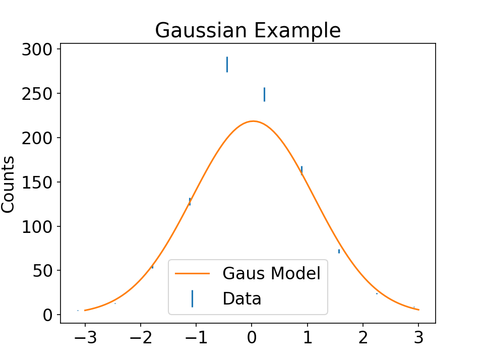

# Using scipy.optimize.curve_fit()

A method of performing a non-linear least squares fit is to use the aptly named `scipy.optimize.curve_fit()`.
This allows us to supply an arbitrary Python function with some initial condition and SciPy will try to minimise the cost function to obtain a suitable model describing the data.
A common usage of this function will look like this:
``` python
import scipy
popt, pcov = scipy.optimize.curve_fit(
	f, x_data, y_data, p0=initial_values, sigma=yerr_data
)
```

Let's run through what each of these arguments mean before we get into an example.

- `f` - This represents the function we want to fit to. It is to be given as a Python function with numerical formal arguments. The first argument should represent the `x` value.
- `x_data` and `y_data` - These will usually be NumPy arrays.
- `p0` - This will be a list of initial values for the non-`x` arguments
- `sigma` - This represents the uncertainty related to our `y_data`.


But what is `popt` and `pcov`?
Well these are the results of our fit. 
If we assume we had \\( n \\) free parameters in our fit, `popt` would be a list of length \\( n \\) showing the estimated value of each parameter which mimimises the sum of the squared residuals between our data and our model.
`pcov` is an matrix of \\( n \\times n \\) containing the estimated covariance between our optimal values in `popt`.

### Gaussian Example
Now I can show a simple example of generating some normally distribution random data using `np.random.normal()` then fitting a Gaussian function to it.
First, let's define some preliminary functions to make the code cleaner and more readable.

``` python
import numpy as np
import matplotlib.pyplot as plt
from scipy.optimize import curve_fit

def gaussian_func(x, mean, std, A):
    return (
        A * np.exp(-((x - mean) ** 2) / (2 * std ** 2))
    )

def get_centres(edges):
    # Take the edges of a histogram and return the centres of each bin as a list
    # Also need to remove the last edge
    bin_width = edges[1] - edges[0]
    return edges[:-1] + bin_width/2
```


``` python
def plot_random_gaus(N):
    N = 1000
    data = np.random.normal(0, 1, N) # Generate randomly distributed data

    # Bin the data and approximate the error due to binning using Poisson statistics
    counts, edges = np.histogram(data)
    counts_uncertainty = counts/np.sqrt(N)

    initial_values = [0, 1, 300]

    x_data = get_centres(edges)
    y_data = counts
    yerr_data = counts_uncertainty

    popt, pcov = curve_fit(
		gaussian_func, x_data, y_data, p0=initial_values, sigma=yerr_data
	)

    # Plot the results
    x = np.linspace(-3, 3, 100)
    y = gaussian_func(x, popt[0], popt[1], popt[2])

    plt.errorbar(x_data, y_data, yerr=yerr_data, linestyle="None", label="Data")
    plt.plot(x, y, label="Gaus Model")
	
	plt.legend()
	plt.title("Gaussian Example")
	plt.ylabel("Counts")
    plt.show()
    
plot_random_gaus(1000)
```



The documentation page for `curve_fit()` can be found [online](https://docs.scipy.org/doc/scipy/reference/generated/scipy.optimize.curve_fit.html).
