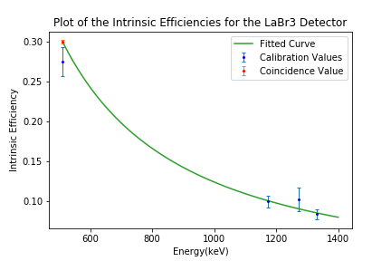

# Plotting

Visualisation of data is the bread and butter of data analysis and science communication.
Like the old saying of a painting, a plot can condense a 1000 words into a neat image.

The most popular graphing package for Python, and the one that will be used in this book, is [Matplotlib](https://matplotlib.org/).
It is heavily integrated into other SciPy packages and allows for us to easily transform our Numpy array into images.

Other plotting packages include:
* [Seaborn](https://seaborn.pydata.org/)  - A plotting package for statistical graphics. Built on top of Matplotlib. [**BSD-3 Clause**]
* [Plotly](https://plotly.com/python/) - A modern web-focused plotting library. [**MIT**]
* [Gnuplot](http://www.gnuplot.info) - The classic unix plotting program. Requires piping data from python to an external program. [**gnuplot**]
