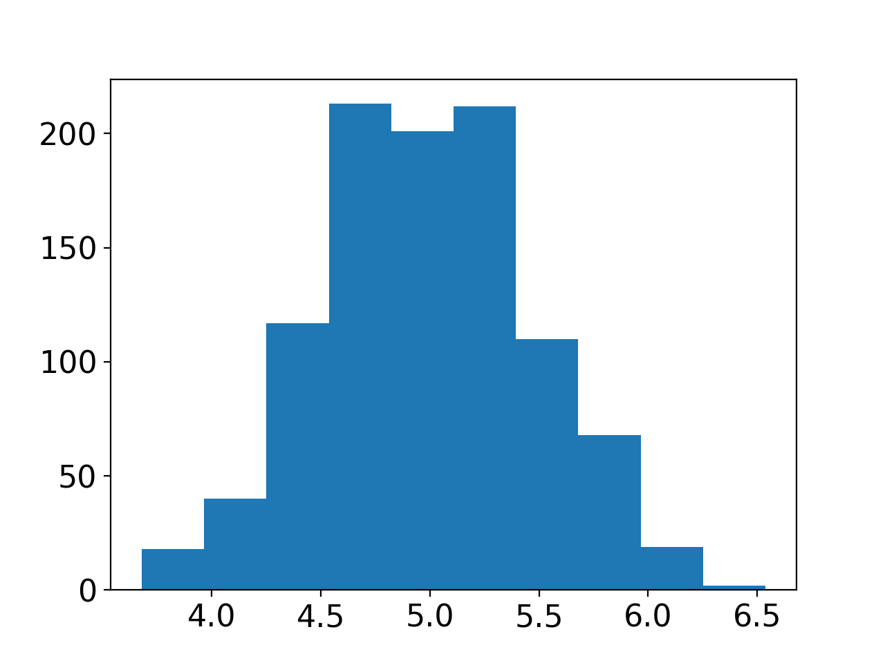
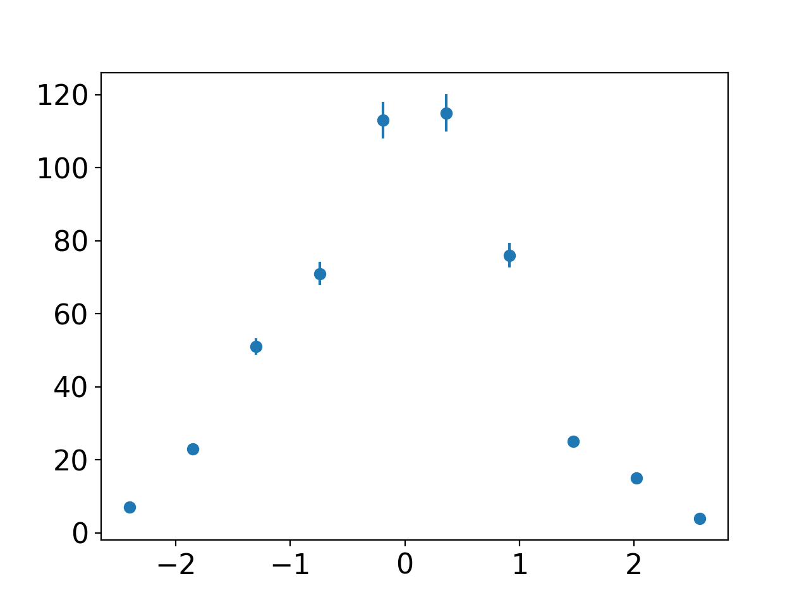

# Working with Histograms
When working in the lab, it is often that we obtain data that is generated through some statistical process.
This is a product of both the randomness of built into nature as well as the uncertainty associated with our measurement instruments of choice.
Histograms provide the perfect tool for representing these distributions of data.

Unbinned data is considered a 1D list of data points which don't have anymore structure than that.
You could receive this type of data if you were to perform repeated measurements of the same distance with a ruler. 

```python
# Provides a Numpy array of 1000 samples of a Gaussian
data = np.random.normal(5, 0.5, 1000)

# This function takes in unbinned data, bins it and adds a plot to the current figure.
plt.hist(data)
plt.show()

# Variant describing the number of bins needed
plt.hist(data, bins=5)

# Variant describing the location of bin edges
plt.hist(data, bins=np.arange(0,5))
```



Documentation for `plt.hist()` can be found [online](https://matplotlib.org/api/_as_gen/matplotlib.pyplot.hist.html?highlight=hist#matplotlib.pyplot.hist).

`plt.hist()` provides a quick method to get a histogram up and running but we don't have a chance to manipulate it.
A common example is when we want to calculate the uncertainty related to each bin.
``` python
# Converts unbinned data into binned data
counts, edges = np.histogram(data)

# The bins variable says how many bins we have
# The weights variable dictates the height of our bins
plt.hist(edges, bins=len(edges), weights=counts)
plt.show()
```

Documentation for `np.histogram()` can be found [online](https://numpy.org/doc/stable/reference/generated/numpy.histogram.html#numpy.histogram).

### Using errorbar() for a Histogram

there are scenarios where representing your histogram as a scatter plot with errors may be beneficial.
When we do this, we need to make sure that we are placing our point in the centre of the bins. 
This could be done similarly to the `get_centres()` function shown below.

``` python
N = 500
data = np.random.normal(0, 1, N)

counts, edges = np.histogram(data)
counts_uncertainty = counts/np.sqrt(N) # Poisson error of each bin

def get_centres(edges):
	# Take the edges of a histogram and return the centres of each bin as a list
	# Also need to remove the last edge
	bin_width = edges[1] - edges[0]
	return edges[:-1] + bin_width/2

centres = get_centres(edges)
plt.errorbar(centres, counts, marker="o", yerr=counts_uncertainty, linestyle="None")
plt.show()
```


